## 실행 방법
1. 다음 저장소를 원하는 위치에 클론 후 해당 폴더로 이동합니다.
```bash
git clone https://github.com/corinthionia/fmp.git
cd ./fmp
```
2. 데이터베이스 생성을 위해 `db.sql`의 SQL문을 실행합니다.
3. 데이터베이스 사용을 위해 유저를 생성합니다. 	
   - 아이디 `minihome` 비밀번호 `miniHome1.1`
   - 혹은 `/src/main/java/com/minihome/util/DBUtil.java`에서 유저 정보를 변경합니다.
4. 스프링 부트 서버를 실행합니다.


## 상세 설명
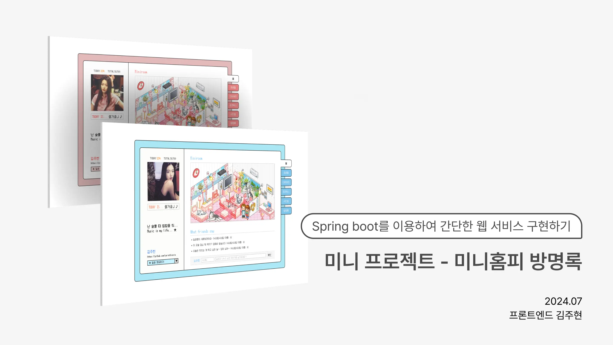

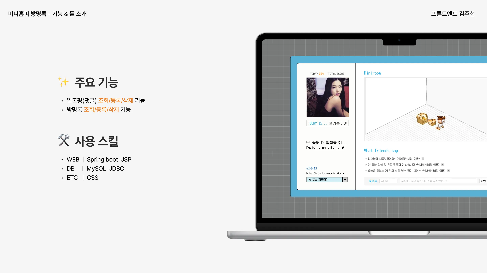
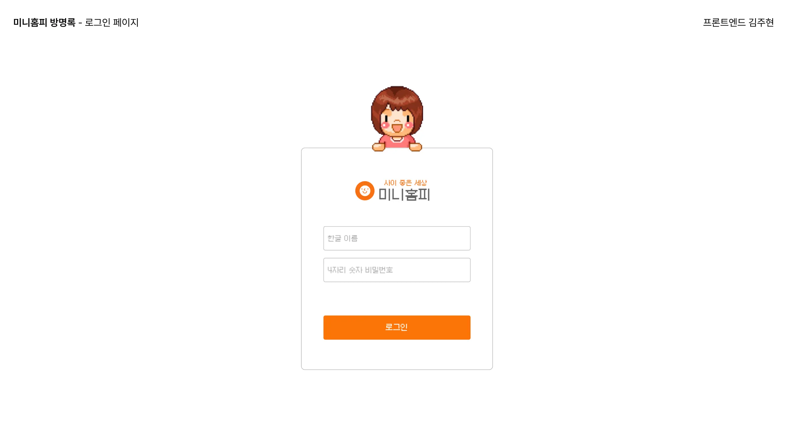
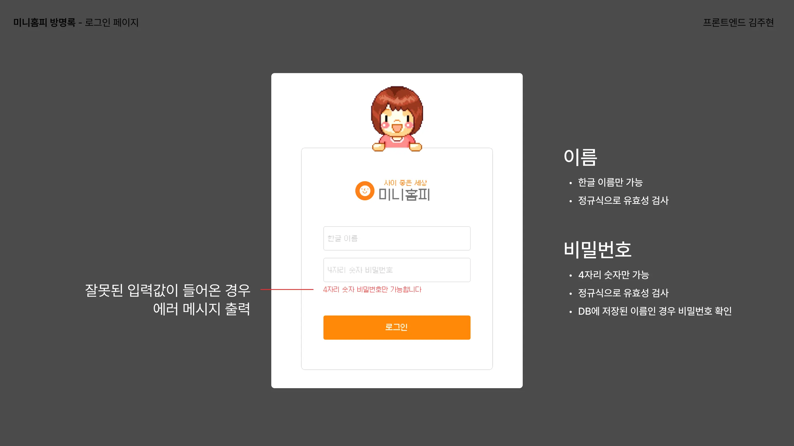
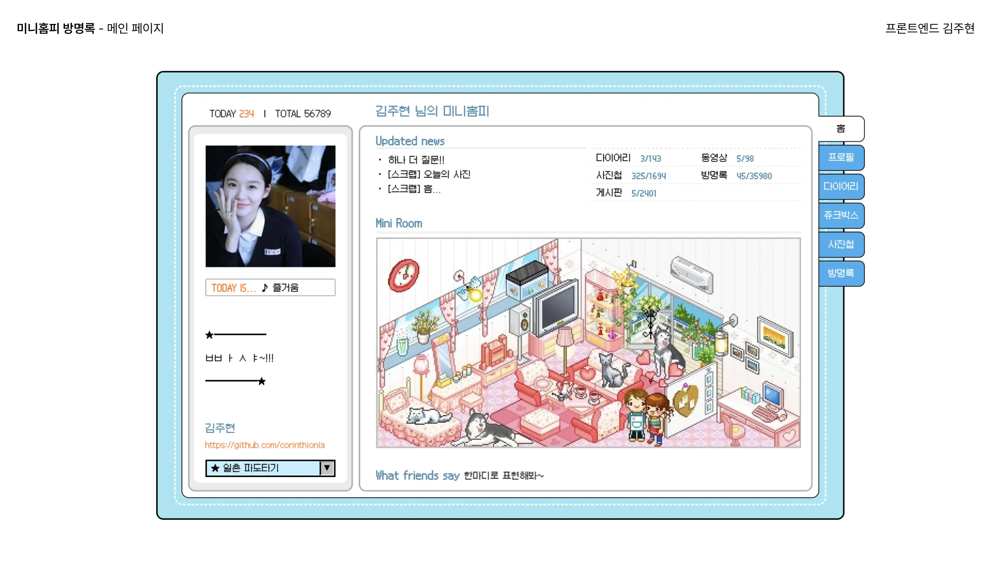
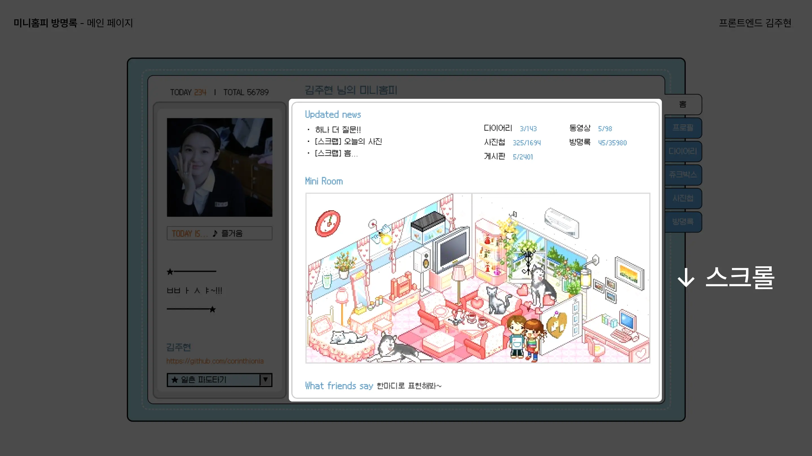
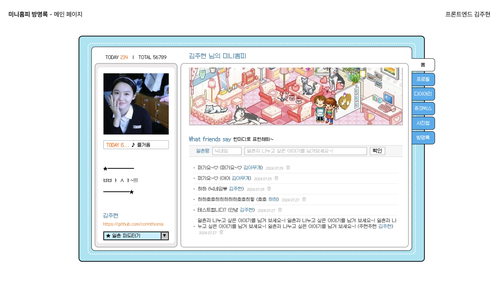
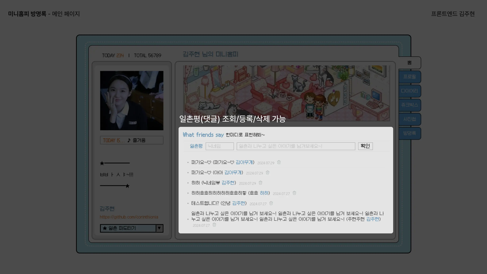
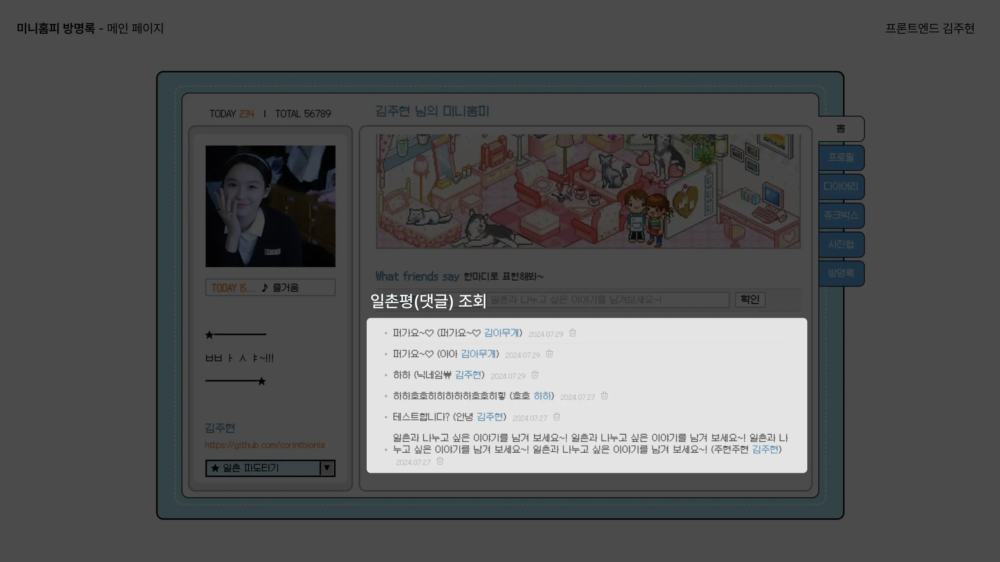
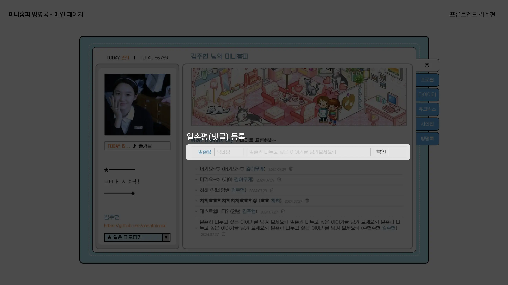
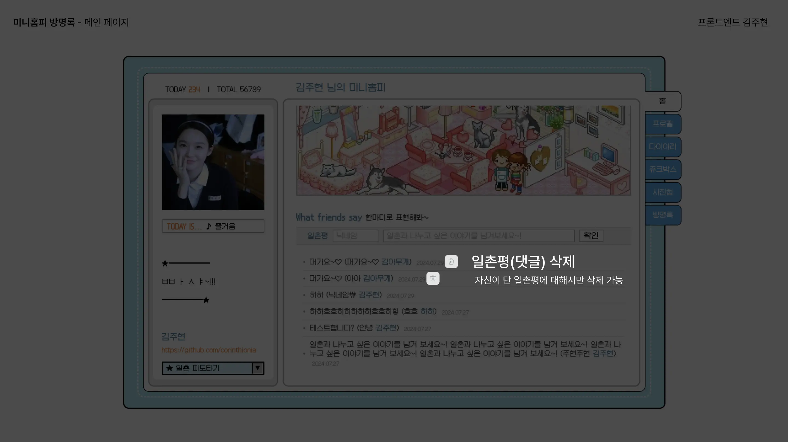
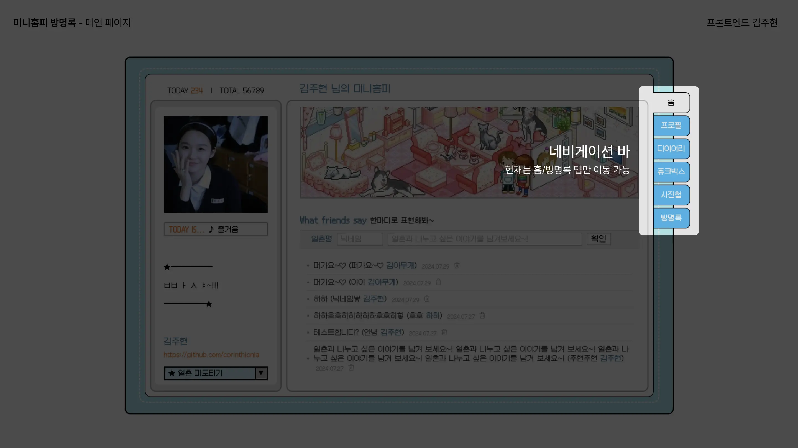
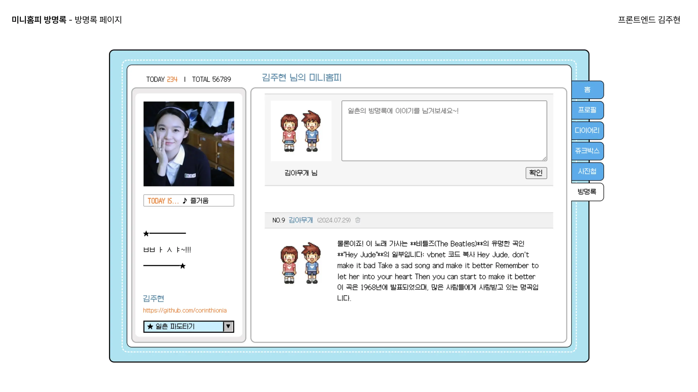
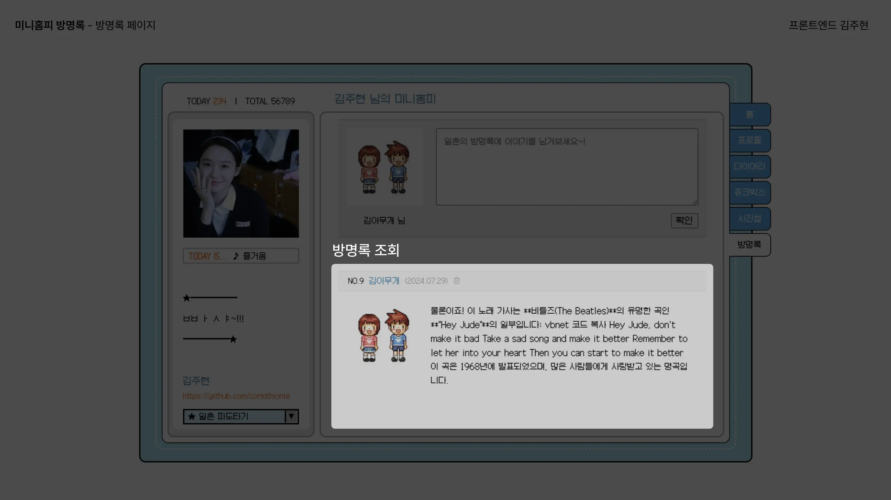
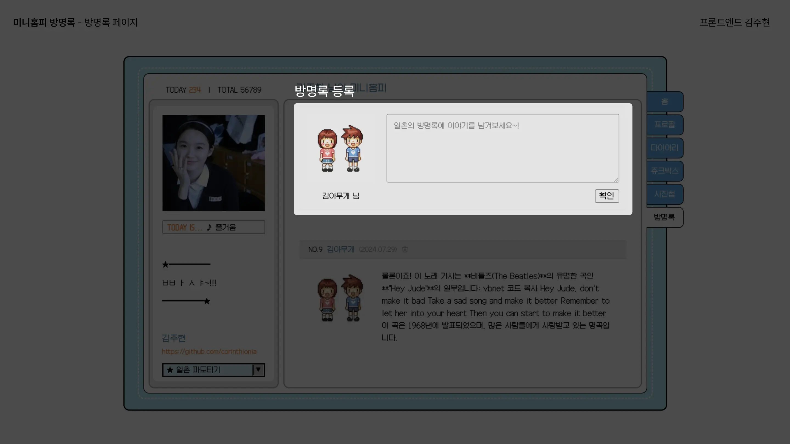
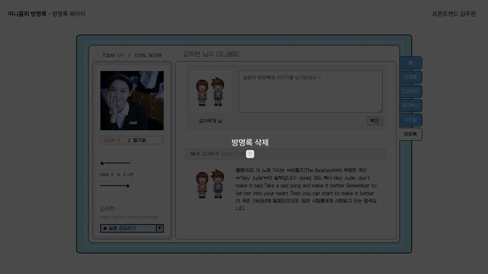

